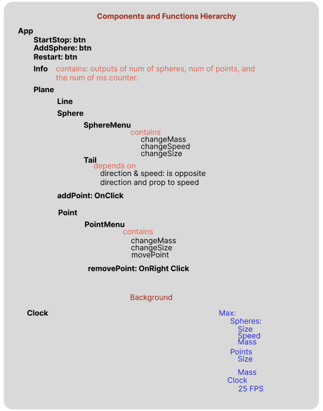

# motion-sim
This project's goal is to ultimately simulate motion of the "sphere" objects on the plane. This was created as interview preparation in hopes of 
getting familiar with the Vue framework and some of the features of D3.js. Currently, the project is ongoing I started with a components
and features plan and am implementing what I can with the timeframe I have.

Below is an image of the planned components and major functions.

